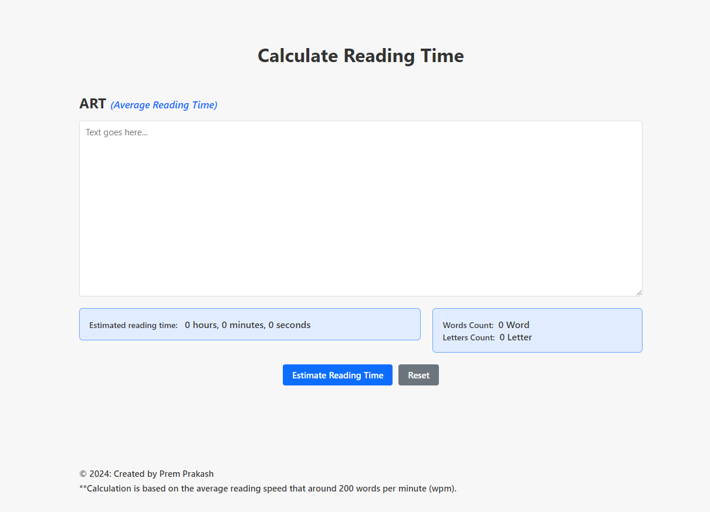

# Calculate Reading Time

A simple web application to estimate the average reading time for a given text.

<!--  -->

## Overview

This project provides a straightforward tool to calculate the estimated reading time for a piece of text. Users can input their text into the provided textarea, and the application will display an estimation of the time it would take an average reader to read the content.

## Usage

1. Open the `index.html` file in a web browser.
2. Enter your text into the textarea provided.
3. Click the "Estimate Reading Time" button to calculate the average reading time.
4. The result will be displayed below the textarea.

## Features

- **Word Count:** The application calculates the number of words in the input text.
- **Average Reading Time:** Using a standard average reading speed, the tool estimates the time it takes to read the given text.

## How to Contribute

If you want to contribute to this project, you can follow these steps:

1. Fork the repository.
2. Clone the forked repository to your local machine.
3. Make your changes and enhancements.
4. Test thoroughly.
5. Create a pull request, describing the changes you've made.

## License

This project is licensed under the [MIT License](LICENSE). Feel free to use, modify, and distribute the code as per the license terms.

## Acknowledgments

- The project uses HTML for the structure and basic styling with CSS.
- Contributions and feedback are welcome!

Feel free to explore the code and contribute to improving the project. If you have any questions or suggestions, don't hesitate to open an issue or a pull request.

---

**Note:** The actual code may be present in the associated files, such as `index.html` and `style.css`. This README provides a high-level overview of the project.
